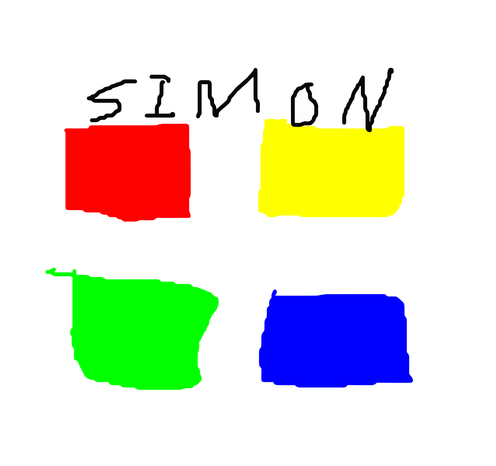
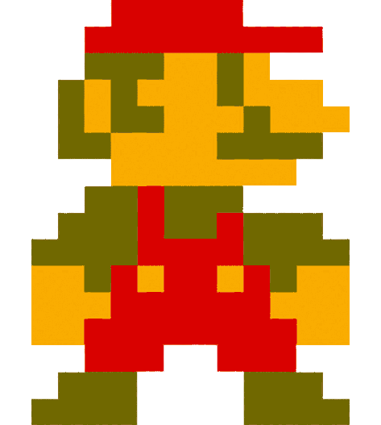
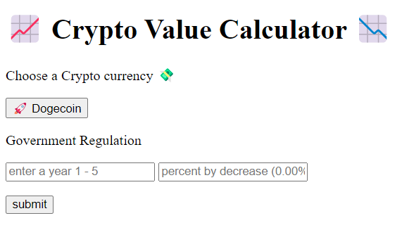
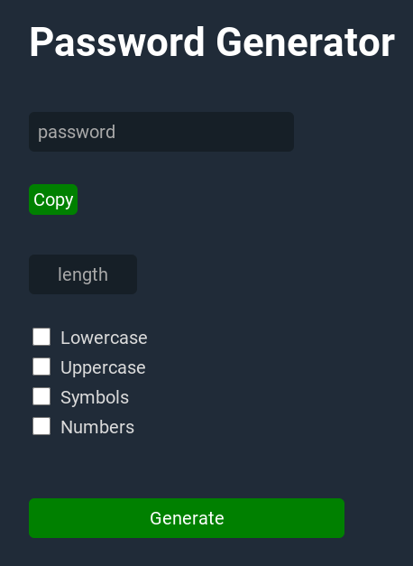

 *Hi! I'm Daniel Stein*

- 👀 I’m interested in expanding my coding expertise 
- 🤝  I’m looking to collaborate on web/mobile applications 

<!---
danieljuliusstein/danieljuliusstein is a ✨ special ✨ repository because its `README.md` (this file) appears on your GitHub profile.
You can click the Preview link to take a look at your changes.
--->
**Connect with me:**

**Languages and Tools:**

 
 

**Learning:**

------------------------

**Portfolio/My Work:**

**In Progress:**

------------------------

  

&nbsp;

[]
